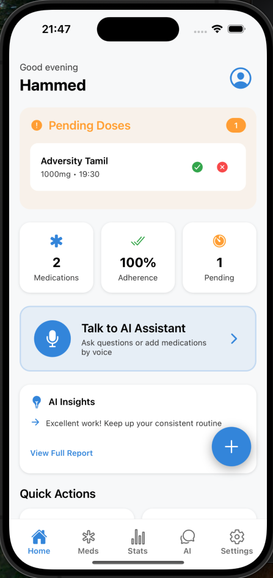
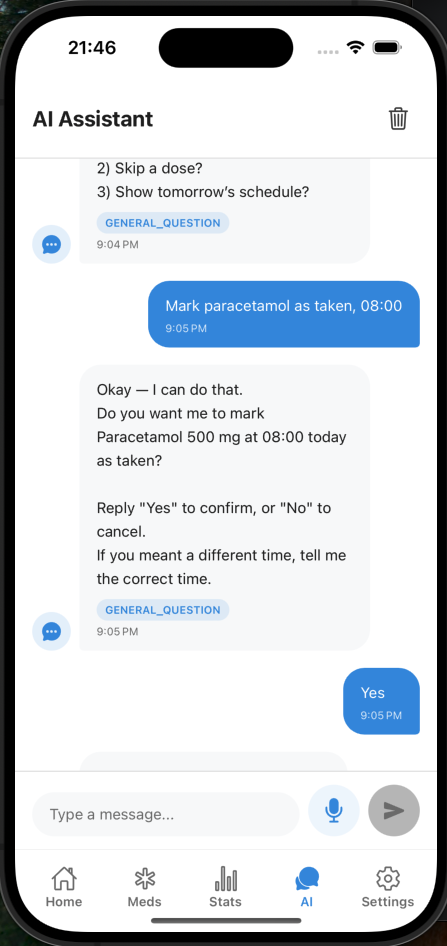
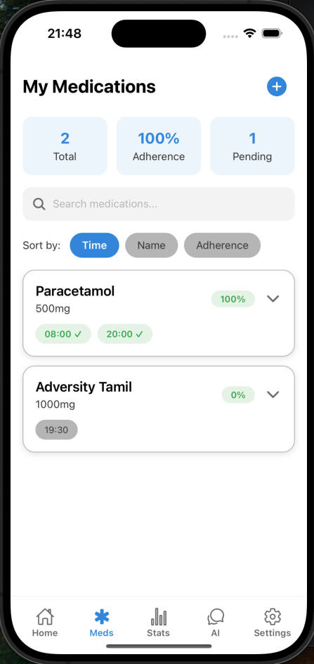
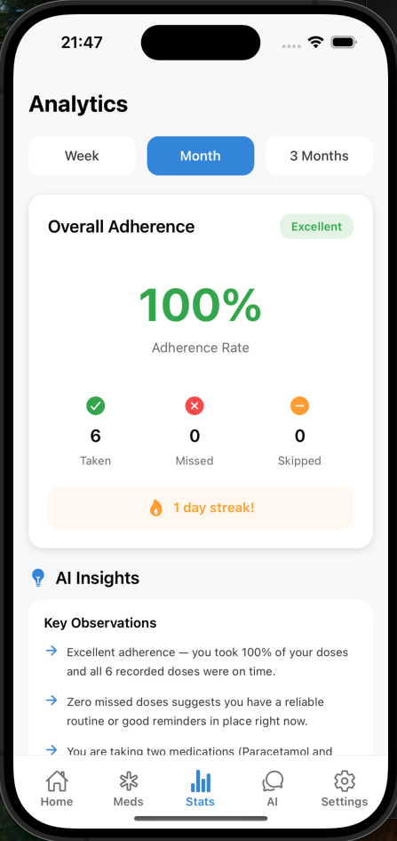
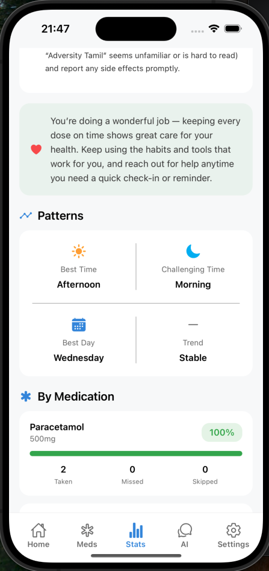

# MediRemind - AI-Powered Medication Reminder App

An intelligent medication management solution designed for elderly users and people with visual impairments, featuring voice-controlled interactions and AI assistance to improve medication adherence and healthcare outcomes.

## The Problem

Medication non-adherence affects 50% of patients with chronic conditions, leading to 125,000 deaths annually and $100 billion in preventable healthcare costs. Elderly patients face unique challenges:

- Complex medication schedules
- Memory issues
- Visual impairments
- Difficulty using traditional apps
- Lack of immediate support

## Our Solution

MediRemind combines AI, voice technology, and intelligent reminders to make medication management effortless and accessible for everyone, especially those who need it most.

## Impact

- **Improved Adherence**: Smart reminders with escalating alerts ensure no doses are missed
- **Reduced Errors**: AI-powered drug interaction checking prevents dangerous combinations
- **Independence**: Voice control enables self-management without caregiver dependency
- **Peace of Mind**: Real-time tracking gives caregivers visibility without being intrusive
- **Better Health Outcomes**: Consistent medication adherence leads to improved treatment effectiveness

## Screenshots

### Home Dashboard


<p><em>Quick overview of daily schedule and pending medications</em>

### AI Voice Assistant



<p><em>Natural conversation for hands-free medication management</em>

### Medication Schedule

  
 
  <p><em>Easy-to-read medication list with search and filters</em>

### Analytics Dashboard

  
 
  <p><em>Track adherence patterns and receive AI-powered insights</em>
</p>

  
 
  <p><em>Additional AI-powered insights and adherence visuals</em>

## Key Features

- **Voice-First Design**: Add medications, mark doses, and get information hands-free
- **AI Assistant**: GPT-4 powered natural conversation for queries and guidance
- **Smart Reminders**: Time-based notifications with progressive escalation
- **Accessibility**: Large text, high contrast, and voice feedback throughout

## Tech Stack

- React Native with Expo
- TypeScript
- OpenAI GPT-4
- Voice Recognition and TTS
- Local MMKV Storage

## Quick Start

```bash
# Clone and install
git clone https://github.com/yourusername/mediremind.git
cd mediremind
npm install

# Add your OpenAI API key to .env
OPENAI_API_KEY=your_key_here

# Start the app
npx expo start
```
